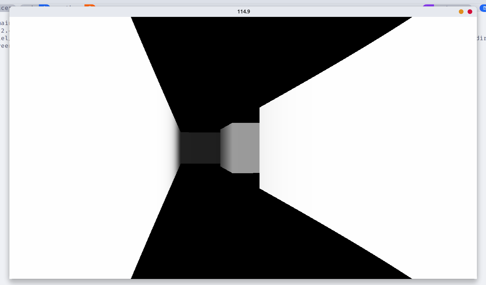

# PyTracer - A Dead simple Raycasting Demo
This repository contains a simple demonstration of raycasting implemented in Python using the [PyGame CE](https://pyga.me/docs/index.html) library. Raycasting is a technique used in computer graphics to render a 3D scene in real-time by simulating the projection of rays from a virtual camera (player's viewpoint) onto a 2D plane (the screen).



## Setup
Before running the demo, ensure you have the correct dependencies installed in a virtual environment:

```bash
pip install -r requirements.txt
```

# Running
To run the demo you just need to execute:

```bash
python main.py
```

Once the demo is running, you can control the player's movement and viewpoint using the WASD for tank-like control and the left and right arrows to rotate.

## Demo Structure

- `main.py`: Main script to run the demo. Contains the `Game` class.
- `settings.py`: Configuration file containing required constants.
- `map.py`: Defines the map layout and the `Map` class.
- `player.py`: Defines the player class and its movement.
- `raycasting.py`: Module containing the raycasting implementation.

## Acknowledgments

This demo is inspired not just by the classic FPS game of the 90s but also by the following videos:
- [Building a Raycasting Engine in Python](https://www.youtube.com/watch?v=O_J8jRq6lBw)
- [Creating a DOOM (Wolfenstein) - style 3D Game in Python](https://www.youtube.com/watch?v=ECqUrT7IdqQ)
- [Make Your Own Raycaster Part 1](https://www.youtube.com/watch?v=gYRrGTC7GtA)
- [Make Your Own Raycaster Part 2](https://www.youtube.com/watch?v=PC1RaETIx3Y)
